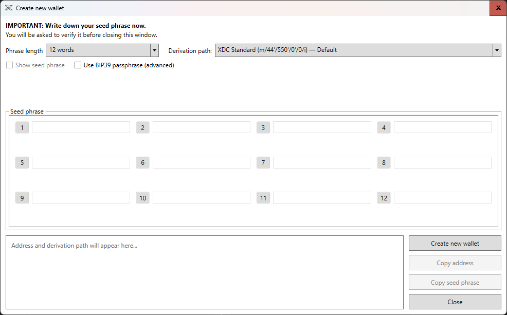
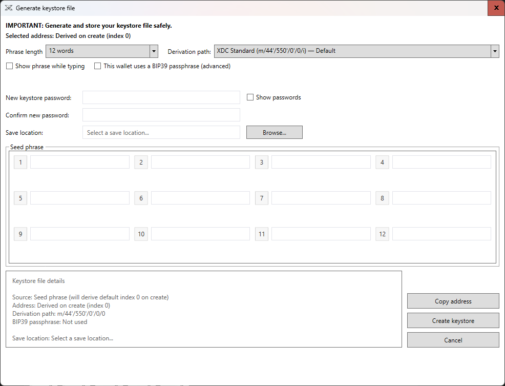
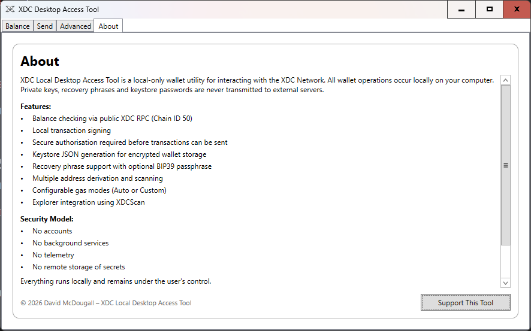
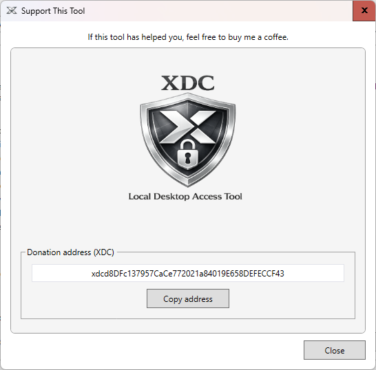

# XDC Local Desktop Access Tool

A local-first desktop utility for interacting with the **XDC Network**.

The application provides wallet functionality and transaction tools while keeping **private keys and signing operations entirely on the user's machine**.

---

# Features

- Balance checking via XDC RPC
- Local transaction signing
- Keystore JSON generation
- BIP39 seed phrase support
- Address derivation and scanning
- Configurable gas settings
- Explorer integration using XDCScan

---

# Screenshots

## Balance Tab

Check wallet balances using the public XDC RPC.

---

## Send Transaction

Create and preview transactions before sending.

---

## Authorisation Window

Local signing requires wallet authorisation.

---

## Wallet Creation

Create a new wallet locally with BIP39 support.

---

## Keystore Generation

Generate encrypted keystore files from seed phrases.

---

## About Tab

Application information and security model overview.

---

## Support Window

The donation address displayed in the application is:

xdcD8DFc137957CaCe772021a84019E658DEFECCF43

Users can verify this inside the application.

---

# Security Philosophy

This software follows a **local-first security model**.

Private keys and seed phrases never leave the user's machine.

Always verify release files before running wallet software.

---

# Building

Requirements

.NET 8  
Windows

Build

dotnet build

Run

dotnet run

---

# License

GNU GPL v3

---

# Author

David McDougall

---

# Disclaimer

This software is provided **as is** without warranty of any kind.
