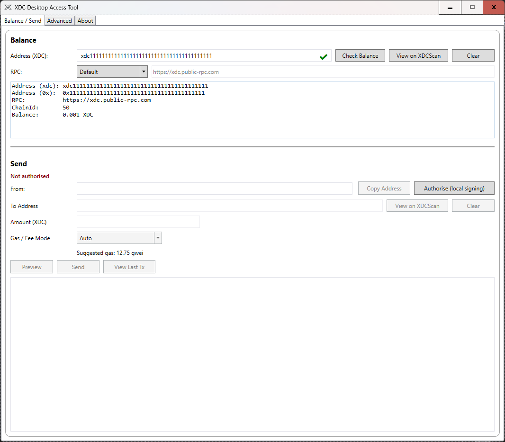
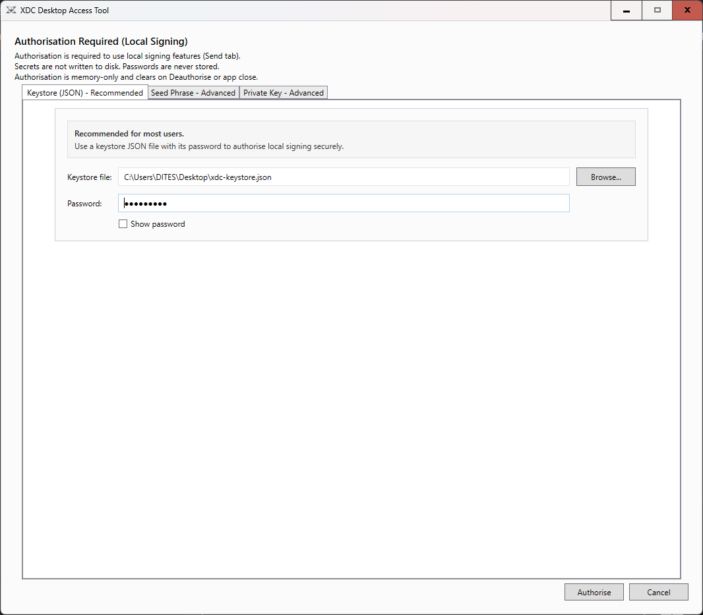
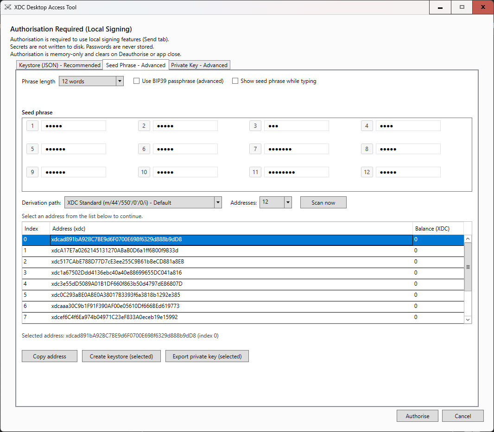
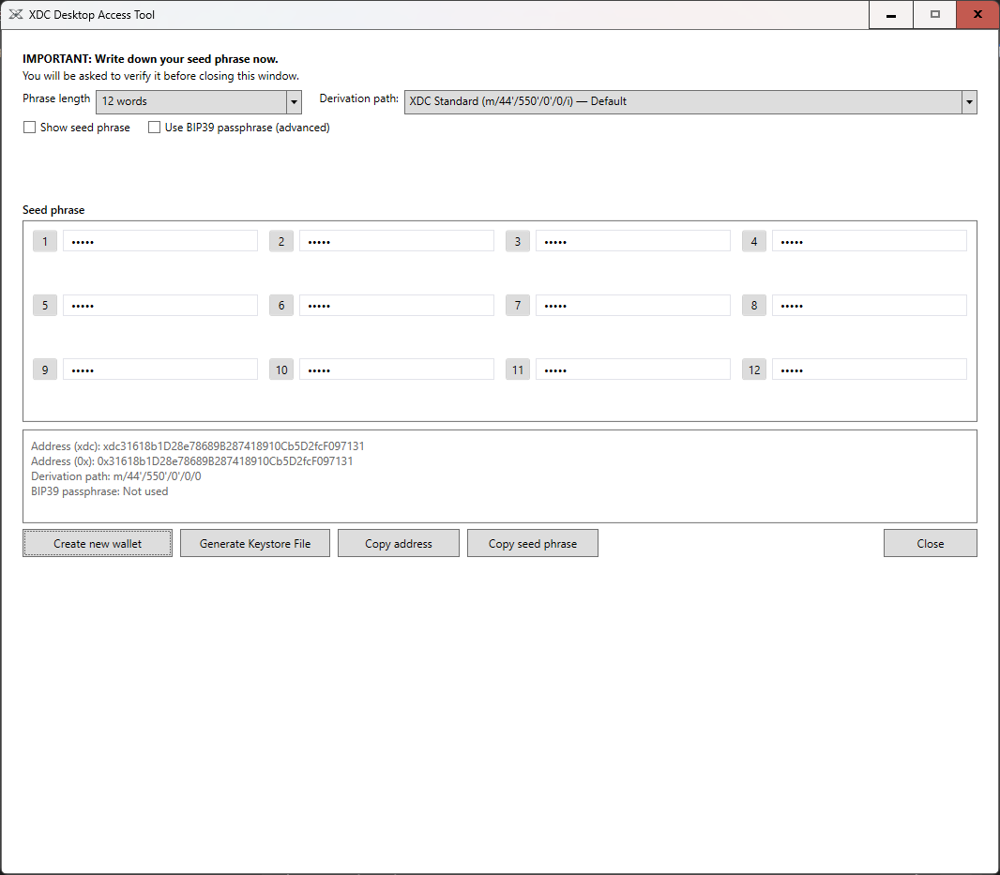
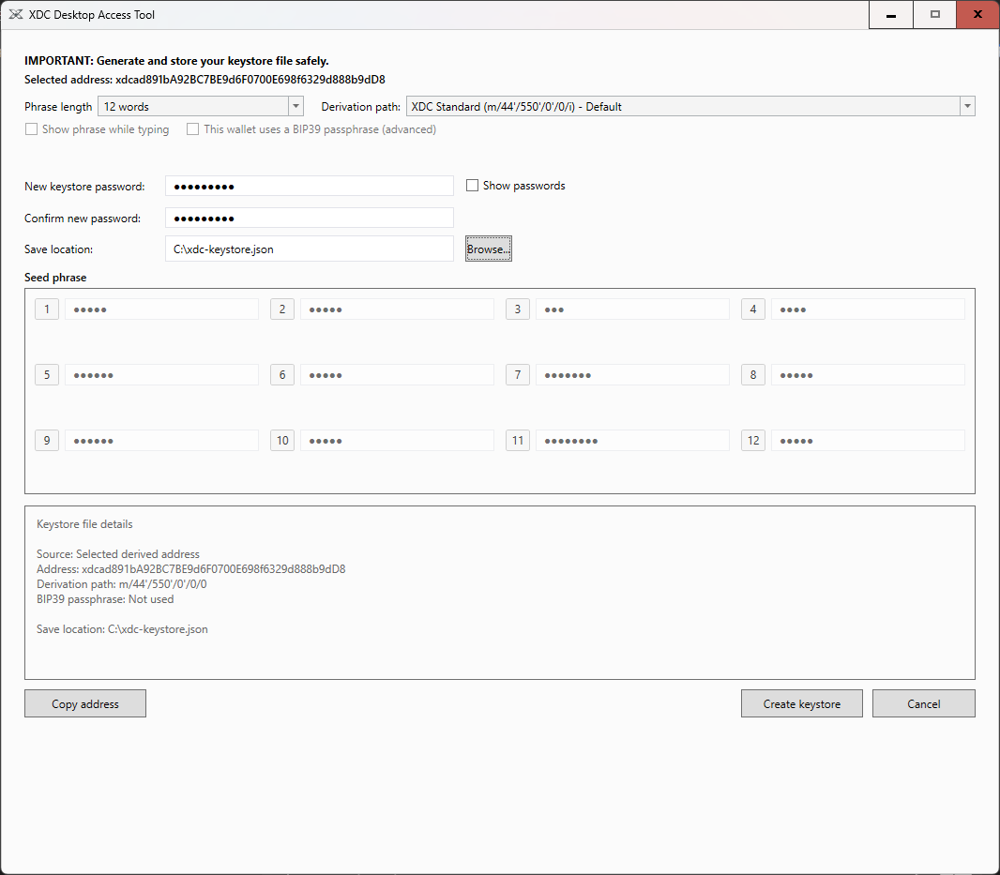
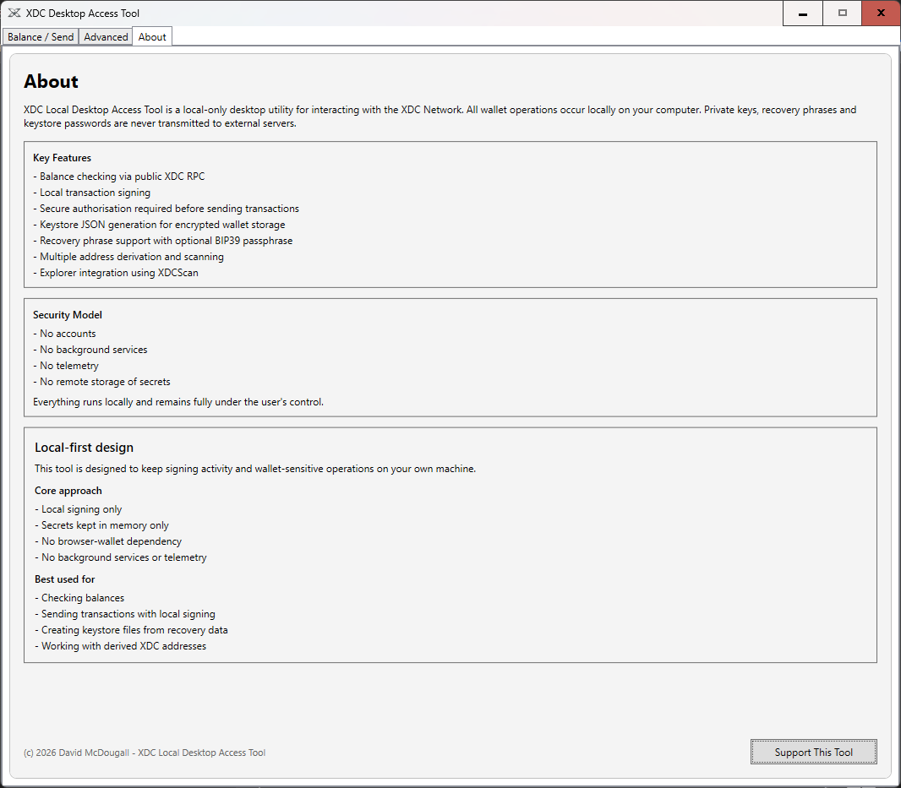

# XDC Local Desktop Access Tool

A local-first desktop utility for interacting with the XDC Network securely.

All wallet operations are performed entirely on your machine — no accounts, no telemetry, and no remote key handling.

---

## Key Features

- Balance checking via XDC RPC
- Local transaction signing
- Secure authorisation using keystore, seed phrase, or private key
- Keystore (JSON) generation for encrypted wallet storage
- BIP39 seed phrase support (12 / 24 words + optional passphrase)
- Multiple address derivation and scanning
- XDCScan integration
- Custom RPC support

---

## Security Model

- No accounts
- No telemetry
- No background services
- No remote storage of secrets

All sensitive operations:
- occur locally
- remain in memory only
- are cleared on deauthorise or app close

As with all wallet software, users are responsible for understanding and securely managing their own keys and environment.

---

## Beta Release Notice

This is a pre-release version of the XDC Local Desktop Access Tool.

The application is functionally complete and operates as intended, however final validation and edge-case testing are still ongoing.

---

## Screenshots

### Balance / Send

### Authorisation (Keystore)

### Seed Phrase + Address Scan

### Create Wallet

### Generate Keystore (Selected Address Mode)

### About

---

## Why this tool exists

This tool was created to reduce phishing risk and give users a local-first way to access XDC wallet functionality without relying on browser-based wallets.

It also helps users recover access to funds by allowing derivation path selection and address scanning, which can be critical when wallets appear empty due to path mismatch rather than missing funds.

---

## Installation

Two download options are provided in Releases:

### Option 1 — Installer (.exe)
Recommended for most users.

1. Download the installer from the latest release
2. Run the installer
3. Follow the on-screen setup steps
4. Launch the application from the desktop or Start menu

### Option 2 — Portable ZIP
For users who prefer to run the app without installing.

1. Download the ZIP package from the latest release
2. Extract all contents to a folder
3. Run the application executable from the extracted folder

---

## Verification

Release files should always be verified before use.

For tagged releases, verification assets are provided on the GitHub Releases page and may include:

- SHA256 checksum file
- PGP signature
- Public release key
- Verification instructions

Always follow the instructions included with the specific release.

---

## Basic Usage

### Check Balance
- Enter an XDC address
- Choose default or custom RPC
- Click **Check Balance**

### Authorise
Use one of:
- Keystore (recommended)
- Seed phrase
- Private key

### Send Transaction
- Enter recipient
- Enter amount
- Preview transaction
- Send using local signing

### Create Wallet
- Generate a wallet
- Write down the recovery phrase securely
- Optionally generate a keystore file

### Generate Keystore
- From Advanced tab: fully editable manual mode
- From selected scanned address: locked recovery context mode

---

## Important

- Never share your seed phrase or private key
- Always verify destination addresses before sending
- Always keep secure backups of your recovery phrase and keystore
- A compromised operating system can still compromise wallet software, regardless of design

---

## Support

XDC donation address:

xdc8DfC137957CaCe772021a84019E658DEFECF43

---

## Author

David McDougall

---

## License

GPL-3.0

