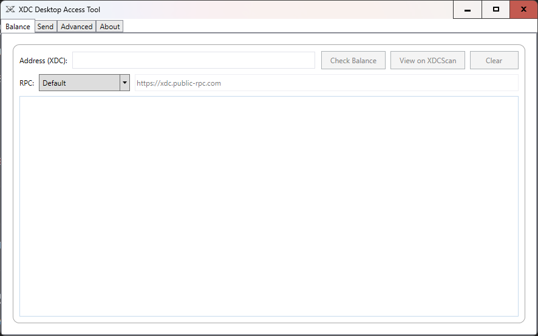
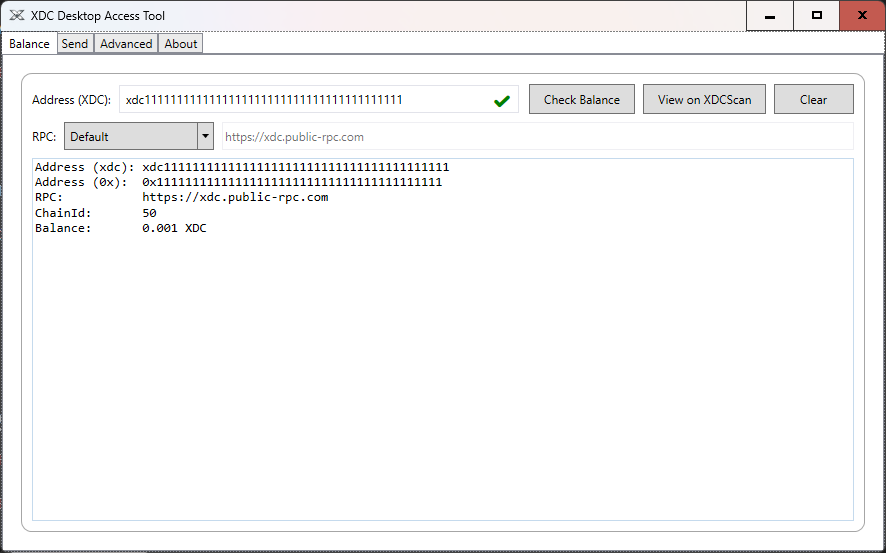
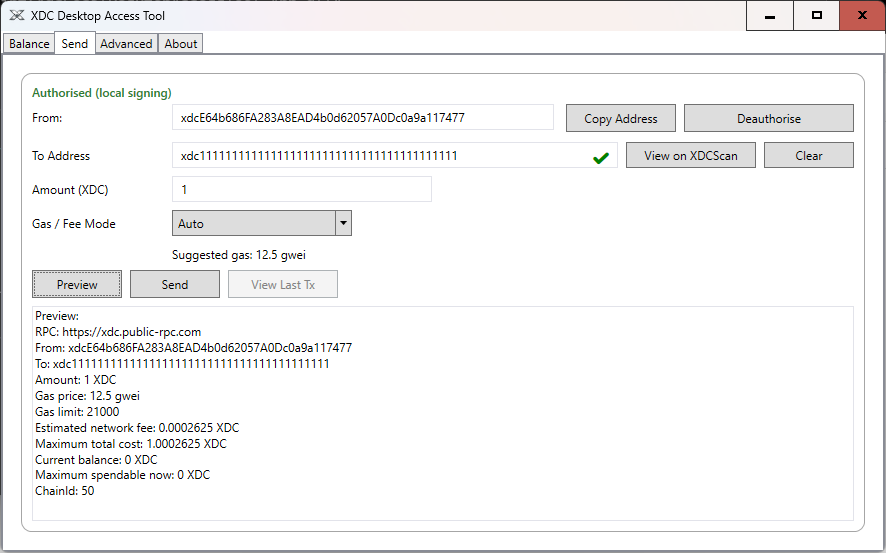
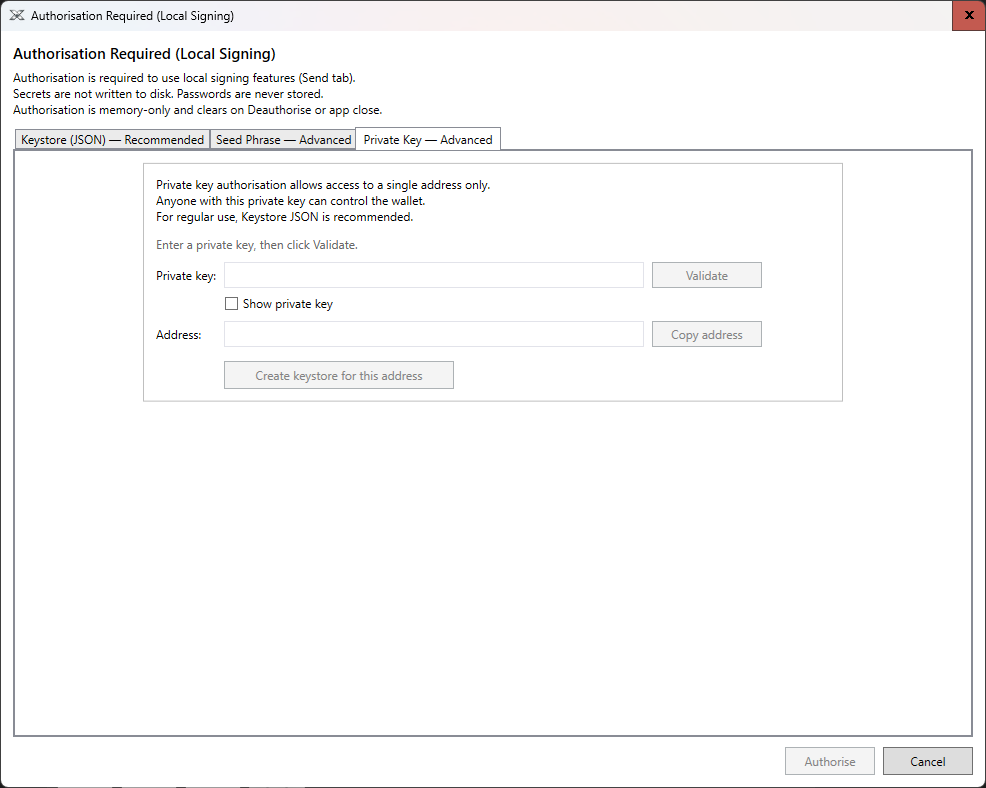
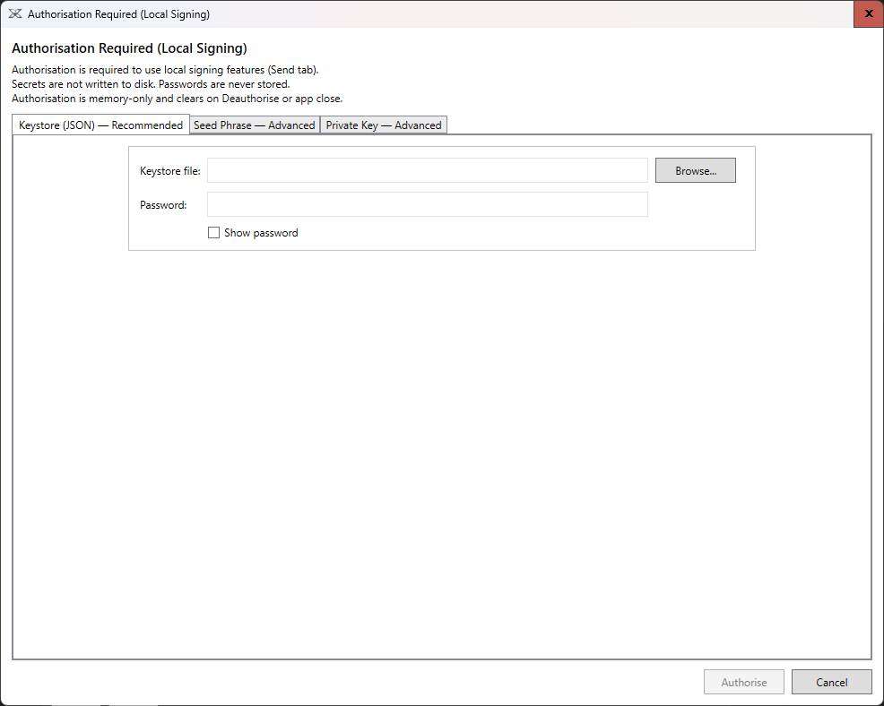
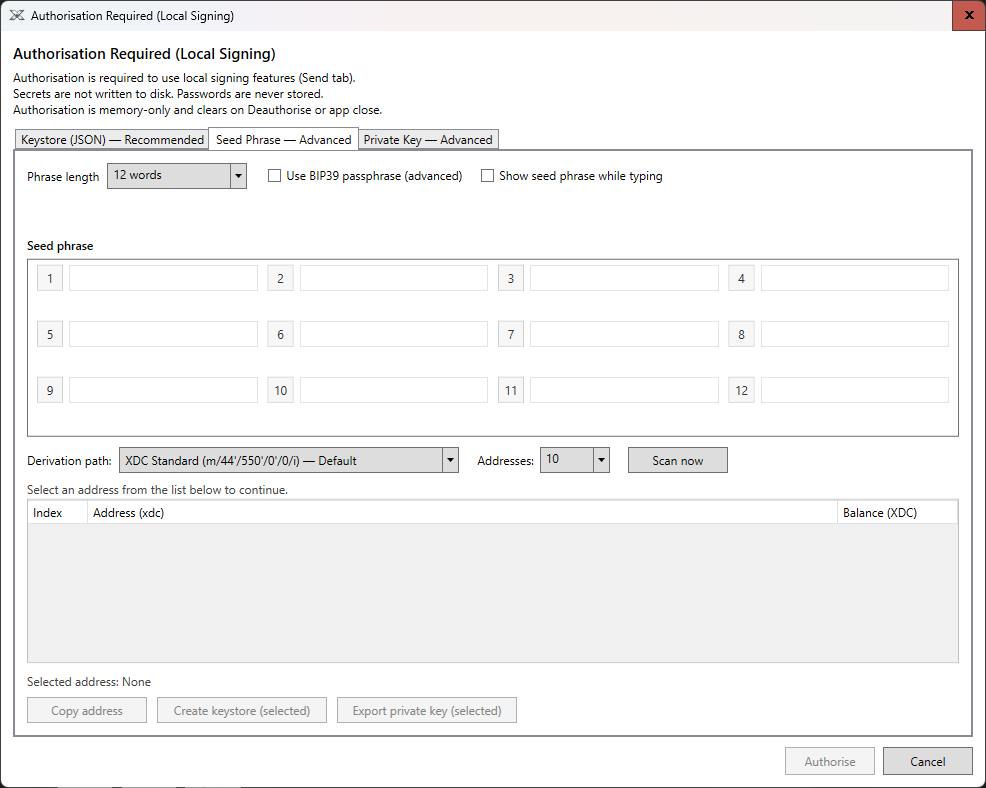

# XDC Local Desktop Access Tool

A local-first desktop utility for interacting with the XDC Network.

The application provides wallet functionality and transaction tools while keeping private keys and signing operations entirely on the user's machine.

---

## Features

- Balance checking via XDC RPC
- Local transaction signing
- Keystore JSON generation
- BIP39 seed phrase support
- Address derivation and scanning
- Configurable gas settings
- Explorer integration using XDCScan

---

## Screenshots

### Balance Tab

---

### Send Transaction

---

### Wallet Creation

---

### Generate Keystore

---

### Authorisation Methods

#### Private Key

#### Keystore

#### Seed Phrase

---

### Support Window

---

### About Tab

---

## Security

Always verify release downloads before running wallet software.

Each release includes:

- SHA256 checksum
- PGP signature
- Public release key
- Verification instructions

---

## License

GPL-3.0
